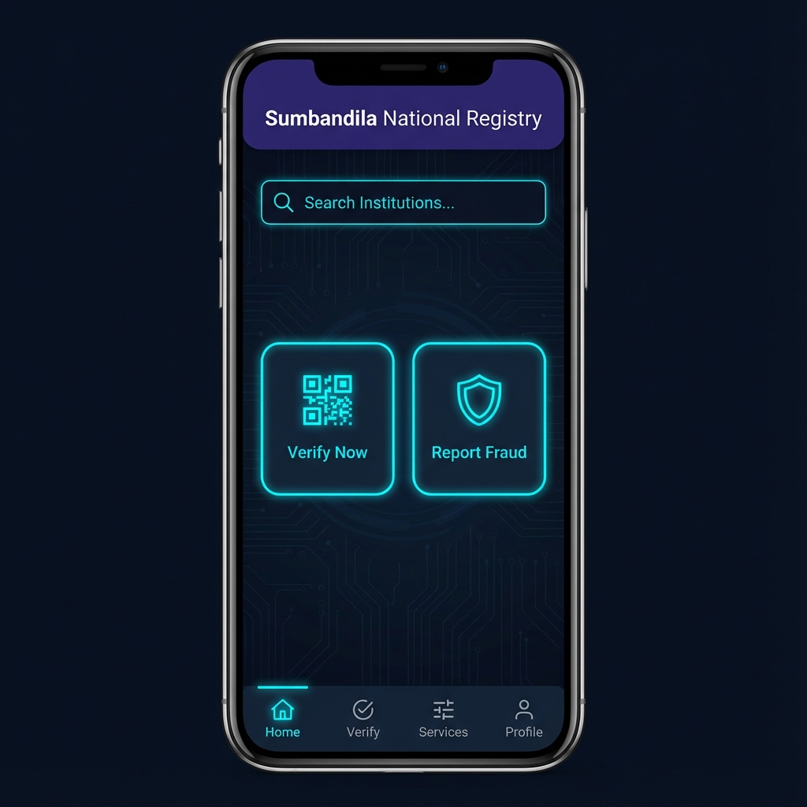

# 🇿🇦 Sumbandila (National Verification Platform)


---

## ⚠️ PROPRIETARY & LEGAL NOTICE

**Copyright © 2026 Kid of Dynamics. All Rights Reserved.**

This software, "Sumbandila", and its underlying architecture, source code, and design are the exclusive intellectual property of **Kid of Dynamics**.

### 🚫 STRICT USAGE WARNING
*   **No Unauthorized Use:** Use of this code, in whole or in part, without explicit written permission from "Kid of Dynamics" is strictly prohibited.
*   **Legal Consequences:** Any unauthorized copying, distribution, or commercial use will be met with immediate legal action under South African and International Copyright Law.
*   **Mandatory Credit:** If permission is granted for educational review, full credit must be given to "Kid of Dynamics".
*   **POPIA Compliance:** This system is designed in compliance with the **Protection of Personal Information Act (POPIA)** of South Africa. Any deployment of this system must adhere to strict data privacy regulations.

---

## 📱 App Demonstration (UI Screenshots)

| **Home Screen** | **Verification Success** |
|:---:|:---:|
|  |  |

*These high-fidelity mockups demonstrate the intended User Experience (UX) for the Public Verification flow.*

---

## 🏗️ Project Overview

**Sumbandila** (meaning "Open the Way") is a senior-level full-stack engineering project designed to address the prevalence of credential fraud in South African education and healthcare.

It acts as a **Digital Trust Infrastructure** that allows Institutions to issue cryptographically signed credentials and public users/employers to verify them instantly via QR code.

---

## 🛠️ Architecture & Tech Stack

### **Frontend (Mobile & Web)**
- **Framework:** React Native (Expo SDK 54)
- **Features:** Dynamic QR Code Scanner, Real-time Verification Logic.

### **Backend (API & Security)**
- **Runtime:** Node.js (v18) + Express.js
- **Security:** **RSA-2048 Digital Signing**, **SHA-256 Hashing**, `bcryptjs` for Password Hashing.

### **Database & Infrastructure**
- **Primary DB:** PostgreSQL 15
- **Caching:** Redis 7
- **DevOps:** Docker & Docker Compose orchestrated.

---

## 🔐 Key Features

1.  **Cryptographic Certification Engine**: Issues Signed Verified Credentials derived from SHA-256 hashes signed with Private RSA Keys.
2.  **Immutable Audit Logs**: Tracks every verification to prevent fraud.
3.  **Advanced SQL Portfolio**: Includes a dedicated `sql_portfolio_project/` folder demonstrating 3NF Normalization and Triggers.

---

## 🚀 How to Run Locally

### Prerequisites
- Docker & Docker Compose
- Node.js v18+

### 1. Start Infrastructure
```bash
docker-compose up --build
```

### 2. Start Frontend
```bash
npx expo start -c
```

---

## 👨‍💻 Author & Rights Holder
**Kid of Dynamics**  
*Senior Full Stack Engineer*

---
*Built with ❤️ in South Africa. Compliant with POPIA.*
