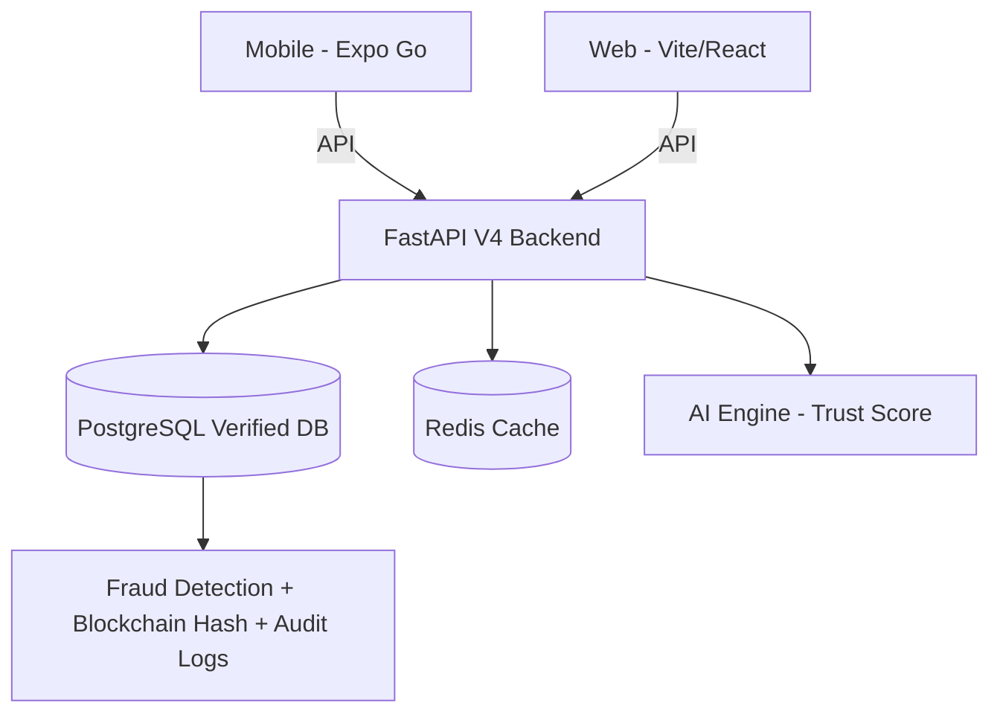

<div align="center">
  
  
> **"Verification in the palm of your hand."**

Sumbandila is a high-integrity public verification platform designed to help South Africans confirm whether educational institutions and professional service providers are legally registered and accredited.

## 📌 Project Purpose
The goal of Sumbandila is to protect the public from fraud, fake qualifications, and unregistered service providers by making verification fast, simple, and accessible.

Through the Sentinel Hub, users can instantly verify:
*   **Private Schools & Colleges**: Registered status with the Department of Higher Education and Training (DHET).
*   **Accredited Courses**: Program accreditation status through relevant education authorities (CHE/SAQA/HEQSF).
*   **Medical Doctors**: Registration standing with the Health Professions Council of South Africa (HPCSA).
*   **Legal Practitioners**: Professional standing with the relevant legal regulatory bodies (LPC).

## 🚀 Key Features
*   **Smart Search**: Instant lookup by institution name or registration number.
*   **Integrity Pulse**: Real-time auditing of registration records.
*   **Digital Certificates**: Downloadable PDF proof of verification for employment or enrollment.
*   **Scam Tracker**: Live alerts on known fake providers and unregistered "phantom" entities.
*   **Sipho AI**: Intelligent audit assistant for answering complex registration queries.

## 💼 Investor Kit
For a detailed breakdown of the business model, pricing strategies, and pitch deck structure, please refer to:
[SENTINEL_INVESTOR_KIT.md](apps/web/SENTINEL_INVESTOR_KIT.md)

## 🛠️ Technology Stack
*   **Frontend**: React (Vite) + Framer Motion + Lucide React
*   **Styling**: Premium Vanilla CSS Design System (Dark Mode optimized)
*   **Deployment**: Vercel ready
*   **Data Integrity**: Sovereign Registry Mock Data (March 2026 DHET/CHE compliant)

---
*© 2026 Sumbandila. All rights reserved. Fighting Corruption through Digital Integrity.*

  [](https://web-gamma-nine-c2cqi2h058.vercel.app)
  [](https://github.com/Raphasha27/Sumbandila-App)
</div>

| 🔍 Verification Area | 🏛️ Authority Checked | 🛡️ What You Get |
|---|---|---|
| **Colleges & Universities** | DHET / CHE / SAQA | Registration status, SAQA ID, NQF level, accreditation |
| **Doctors & Specialists** | HPCSA / Psytech | HPCSA number, specialisation, hospital affiliation |
| **Lawyers & Advocates** | LPC / GCB | Practising status, Fidelity Fund Certificate, LPC number |
| **Psychologists** | Psytech SA | Registration status and practice standing |

---

## ✨ New in V4.5 — The "Pitch-Ready" Sentinel Update

- 🤖 **Context-Aware Sipho AI Chatbot** — Sipho now monitors your active screen to provide real-time, actionable advice. Seamlessly save verification records to your Vault or instantly search the registry through voice or text.
- 💻 **Premium Laptop Experience** — Transformed from a mobile-only portal into a fully responsive, multi-column dashboard for professional desktop auditing.
- 💎 **Practitioner Trust Network** — Official onboarding portal for verified professionals to join the registry.
- 📡 **Live Portal Scraper** — Embedded **December 2025 DHET Official Registry** synchronization. Automatically flags deregistered entities.
- 🥇 **Gold Trust Badges** — Visual verification indicators for high-integrity practitioners.

---

## 🏛️ Government-Grade Platform

### Major Capabilities:

- **AI Fraud Detection** — Rule-based + ML engine (RandomForestClassifier) scoring trust 0–100%.
- **Blockchain Credential Hashes** — SHA-256 tamper-proof fingerprint for every verified entity.
- **5-Language Support** — English, isiZulu, Afrikaans, Sepedi, Xitsonga.
- **🎙️ Voice Reports** — Citizens submit reports in any official language, stored in the Sovereign Registry Vault.
- **Active Warning Lists** — Deregistered colleges (e.g., Damelin, City Varsity, Lyceum) dynamically flagged on every search.

---

## 🏗️ Architecture


```mermaid
graph TD
    A[Mobile - Expo Go] -->|API| C[FastAPI V4 Backend]
    B[Web - Vite/React] -->|API| C
    C --> D[(PostgreSQL Verified DB)]
    C --> E[(Redis Cache)]
    C --> F[AI Engine - Trust Score]
    D --> G[Fraud Detection + Blockchain Hash + Audit Logs]
```

---

## 📁 Monorepo Structure

```text
sumbandila/
├── apps/
│   ├── web/                    # Vite + React production app
│   └── mobile/                 # Expo Go mobile app (React Native 0.85)
├── services/
│   ├── core/                   # FastAPI V4 backend (Python 3.12)
│   └── ai/                     # ML modules (Fraud detection, trust scoring)
├── infra/                      # CI/CD and Kubernetes orchestration
├── packages/                   # Shared types and utility logic
├── data/                       # Mock registry data (50k+ records)
└── vercel.json                 # Unified deployment configuration
```

---

## 🚀 Deployment & Integrity

- **Frontend**: Deployed on Vercel with automated CI/CD.
- **Backend**: Containerized via Docker for K8s scalability.
- **Security**: 0 vulnerabilities via pinned dependencies and root-level toolchain enforcement. Dependabot automated vulnerability patching actively maintained.

---

## 💼 Launch & Investment

Everything you need to move from code to market:

- **Investor Deck**: Professional pitch templates available in `docs/investor_launch_kit.md`.
- **Mock Data**: 50,000+ realistic registry records ready for load testing.
- **ML Engine**: Production-grade RandomForest model for fraud scoring.

<div align="center">
  <br/>
  <i>© 2026 Sumbandila Registry Sentinel · Built for national integrity and public trust by Kirov Dynamics.</i>
</div>
