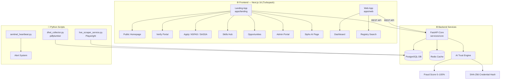
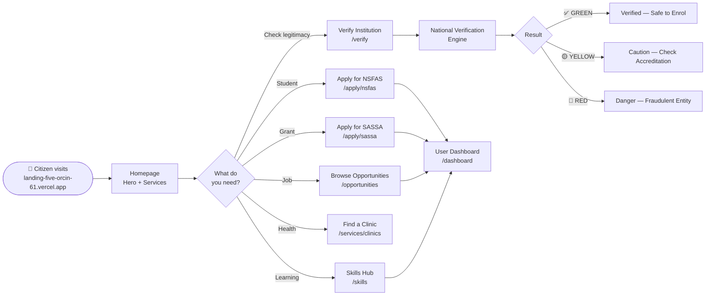
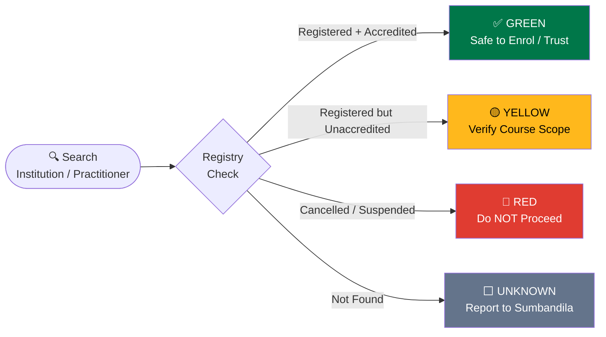
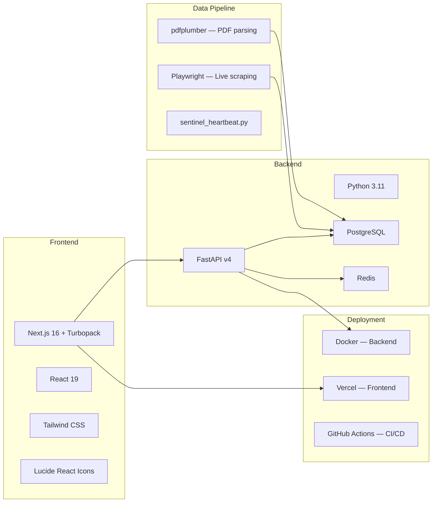

<div align="center">

# 🇿🇦 SUMBANDILA
### National Youth Growth Ecosystem — Republic of South Africa

> *"Sumbandila" (Venda) — "The one who leads the way."*

[](https://landing-five-orcin-61.vercel.app)
[](https://nextjs.org)
[](LICENSE)
[](SECURITY.md)

</div>
---

## 🔗 Official Demo
**Live Platform:** [https://landing-five-orcin-61.vercel.app](https://landing-five-orcin-61.vercel.app)

---

## 📌 What Is Sumbandila?

Sumbandila is an **official national digital infrastructure platform** built to connect South African citizens — especially youth — to verified opportunities, government services, skills training, and institutional accreditation. It replaces scattered, hard-to-find government portals with a single, trusted, beautiful interface.

**Who it helps:**
- 🎓 **Students** — Find NSFAS funding, verified TVET colleges, and bursaries
- 💼 **Job seekers** — Discover verified employment opportunities across 9 provinces
- 👴 **Elderly citizens** — Access SASSA grants and food relief programme guidance
- 🏥 **The public** — Verify doctors, lawyers, institutions before trusting them
- 🏛️ **Government** — A unified youth growth registry powered by real DHET/CHE/HPCSA data

---

## ✨ What's New — V5.0 (April 2026)

| Feature | Description |
|---|---|
| 🏘️ **People of SA Section** | Photo-driven community section: youth, elderly food relief, diverse conversations |
| 🏛️ **Landmark Slideshow (Footer)** | Auto-rotating Nelson Mandela Bridge ↔ Union Buildings imagery |
| ⚡ **Citizen Quick Services** | One-click access to NSFAS, SASSA, Clinic Finder, Skills Hub |
| 🤖 **Sipho AI Floating Assistant** | Context-aware AI guide available on every page |
| 🌍 **5-Language Nav** | EN / isiZulu / Xhosa / Afrikaans / Sepedi language toggle |
| 📊 **Live Registry Pulse** | Real-time stats: 1.2M+ youth, 4,208 institutions, 12,450 opportunities |
| 🛡️ **National Verification Engine** | Verify institutions, practitioners, and credentials instantly |
| 🎨 **Ndebele Design System** | SA flag colour-band motifs, Batho Pele branding throughout |

---

## 🗺️ Platform Architecture


```mermaid
graph TD
    subgraph "🌐 Frontend — Next.js 16 (Turbopack)"
        A[Landing App<br/>apps/landing] --> B[Public Homepage]
        A --> C[Verify Portal]
        A --> D[Apply: NSFAS / SASSA]
        A --> E[Skills Hub]
        A --> F[Opportunities]
        A --> G[Admin Portal]
        A --> H[Sipho AI Page]
        W[Web App<br/>apps/web] --> I[Dashboard]
        W --> J[Registry Search]
    end

    subgraph "⚙️ Backend Services"
        K[FastAPI Core<br/>services/core] --> L[(PostgreSQL DB)]
        K --> M[(Redis Cache)]
        K --> N[AI Trust Engine]
    end

    subgraph "🐍 Python Scripts"
        O[dhet_collector.py<br/>pdfplumber] --> L
        P[live_scraper_service.py<br/>Playwright] --> L
        Q[sentinel_heartbeat.py] --> R[Alert System]
    end

    A -->|REST API| K
    W -->|REST API| K
    N --> S[Fraud Score 0–100%]
    N --> T[SHA-256 Credential Hash]
```

---

## 🔄 User Journey Flow


```mermaid
flowchart LR
    Start([🧑 Citizen visits\nlanding-five-orcin-61.vercel.app]) --> Home[Homepage\nHero + Services]
    Home --> Choice{What do\nyou need?}

    Choice -->|Student| NSFAS[Apply for NSFAS\n/apply/nsfas]
    Choice -->|Grant| SASSA[Apply for SASSA\n/apply/sassa]
    Choice -->|Job| Opp[Browse Opportunities\n/opportunities]
    Choice -->|Learning| Skills[Skills Hub\n/skills]
    Choice -->|Health| Clinic[Find a Clinic\n/services/clinics]
    Choice -->|Check legitimacy| Verify[Verify Institution\n/verify]

    Verify --> Engine[National Verification\nEngine]
    Engine --> Result{Result}
    Result -->|✅ GREEN| Safe[Verified — Safe to Enrol]
    Result -->|🟡 YELLOW| Caution[Caution — Check Accreditation]
    Result -->|🔴 RED| Danger[Danger — Fraudulent Entity]

    NSFAS --> Dashboard[User Dashboard\n/dashboard]
    SASSA --> Dashboard
    Opp --> Dashboard
    Skills --> Dashboard
```

---

## 🏗️ Monorepo Structure

```
sumbandila/
├── apps/
│   ├── landing/                  ← 🏠 Main Next.js 16 public-facing app
│   │   ├── app/
│   │   │   ├── page.jsx          ← Homepage (Hero, Services, Community)
│   │   │   ├── verify/           ← National Verification Engine
│   │   │   ├── apply/
│   │   │   │   ├── nsfas/        ← NSFAS application portal
│   │   │   │   └── sassa/        ← SASSA grants portal
│   │   │   ├── opportunities/    ← Jobs & opportunities browser
│   │   │   ├── skills/           ← TVET & certified courses
│   │   │   ├── webinars/         ← Live learning sessions
│   │   │   ├── membership/       ← Youth membership onboarding
│   │   │   ├── leadership/       ← Mentorship & governance
│   │   │   ├── collaborations/   ← NGO & partner hub
│   │   │   ├── admin/            ← Secured admin portal
│   │   │   └── sipho-ai/         ← Sipho AI assistant page
│   │   ├── components/
│   │   │   ├── SiteNav.jsx       ← Sticky nav with ticker + language toggle
│   │   │   ├── SiteFooter.jsx    ← Footer with landmark slideshow
│   │   │   └── SiphoFloatingAssistant.jsx
│   │   └── public/               ← Static assets (committed to Git)
│   │       ├── sa-logo.png       ← Official Coat of Arms
│   │       ├── mandela-bridge.png← Nelson Mandela Bridge (JHB)
│   │       ├── union-buildings.png← Union Buildings (PTA)
│   │       ├── sa-youth.png      ← Diverse SA youth photo
│   │       ├── elderly-food-parcels.png ← Community relief photo
│   │       └── diverse-community.png    ← Unity/ubuntu photo
│   ├── web/                      ← React + Vite secondary app
│   └── mobile/                   ← Expo Go mobile app (React Native)
│
├── services/
│   └── core/                     ← FastAPI V4 backend (Python 3.11)
│       ├── main.py
│       └── requirements.txt
│
├── scripts/                      ← Python data pipeline & automation
│   ├── dhet_collector.py         ← PDF scraper (pdfplumber)
│   ├── live_scraper_service.py   ← Live portal scraper (Playwright)
│   ├── sentinel_heartbeat.py     ← Daily portal health monitor
│   └── local_security_audit.py   ← Dependency vulnerability audit
│
├── data/                         ← 50,000+ mock registry records
├── packages/                     ← Shared types and utilities
├── infra/                        ← Docker & CI/CD configs
├── pyproject.toml                ← Python linting config (Pyright)
├── vercel.json                   ← Vercel deployment config
└── package.json                  ← NPM workspaces root
```

---

## 🛡️ Verification Colour System


```mermaid
graph LR
    Search([🔍 Search\nInstitution / Practitioner]) --> Check{Registry\nCheck}
    Check -->|Registered + Accredited| Green["✅ GREEN\nSafe to Enrol / Trust"]
    Check -->|Registered but Unaccredited| Yellow["🟡 YELLOW\nVerify Course Scope"]
    Check -->|Cancelled / Suspended| Red["🔴 RED\nDo NOT Proceed"]
    Check -->|Not Found| Grey["⬜ UNKNOWN\nReport to Sumbandila"]

    style Green fill:#007749,color:#fff
    style Yellow fill:#FFB81C,color:#000
    style Red fill:#E03C31,color:#fff
    style Grey fill:#64748b,color:#fff
```

| Colour | Meaning | Action |
|---|---|---|
| ✅ **GREEN** | Registered + Accredited | Safe to enrol / engage |
| 🟡 **YELLOW** | Registered, unaccredited course | Verify specific programme scope |
| 🔴 **RED** | Cancelled, suspended, or on fraud list | Do NOT proceed — report |
| ⬜ **UNKNOWN** | Not found in any registry | Submit a tip via Feedback |

---

## 🧰 Tech Stack


```mermaid
graph LR
    subgraph Frontend
        NX[Next.js 16 + Turbopack]
        RC[React 19]
        TW[Tailwind CSS]
        LC[Lucide React Icons]
    end
    subgraph Backend
        FA[FastAPI v4]
        PY[Python 3.11]
        PG[PostgreSQL]
        RD[Redis]
    end
    subgraph Data Pipeline
        PB[pdfplumber — PDF parsing]
        PL[Playwright — Live scraping]
        SC[sentinel_heartbeat.py]
    end
    subgraph Deployment
        VC[Vercel — Frontend]
        DK[Docker — Backend]
        GH[GitHub Actions — CI/CD]
    end
    NX --> FA
    FA --> PG
    FA --> RD
    PB --> PG
    PL --> PG
    NX --> VC
    FA --> DK
```

| Layer | Technology |
|---|---|
| **Landing App** | Next.js 16, React 19, Tailwind CSS, Turbopack |
| **Web App** | React 19, Vite, Framer Motion |
| **Mobile** | Expo Go, React Native |
| **Backend** | FastAPI v4, Python 3.11, Uvicorn |
| **Database** | PostgreSQL, Redis |
| **AI Engine** | RandomForestClassifier (Trust Scoring), Sipho AI |
| **Data Scripts** | pdfplumber, Playwright |
| **Deployment** | Vercel (frontend), Docker + K8s (backend) |
| **Security** | SHA-256 credential hashing, POPIA-compliant |

---

## 🚀 Running Locally

### Prerequisites

| Tool | Minimum Version | Check |
|---|---|---|
| Node.js | 20.x | `node -v` |
| npm | 10.x | `npm -v` |
| Python | 3.11+ | `python --version` |
| Git | Any | `git --version` |

### 1. Clone the repository

```bash
git clone https://github.com/Raphasha27/Sumbandila-App.git
cd Sumbandila-App
```

### 2. Install JavaScript dependencies

```bash
npm install
```

### 3. Set up environment variables

```bash
# Copy the example env file for the landing app
cp apps/landing/.env.local.example apps/landing/.env.local
```

Then open `apps/landing/.env.local` and fill in your Supabase credentials:

```env
NEXT_PUBLIC_SUPABASE_URL=your_supabase_project_url
NEXT_PUBLIC_SUPABASE_ANON_KEY=your_supabase_anon_key
```

> **Don't have Supabase?** The app works without it — verification uses mock data locally.

### 4. Start the development server

```bash
npm run dev
```

This starts the **landing app** at → **http://localhost:3000**

> The web app (Vite) will also start if present. Check your terminal for its port.

### 5. (Optional) Python backend & scripts

```bash
# Install Python dependencies for the API backend
pip install -r services/core/requirements.txt

# Install script dependencies (data pipeline)
pip install pdfplumber playwright
playwright install chromium

# Start FastAPI backend
cd services/core
uvicorn main:app --reload --port 8000
```

Backend API runs at → **http://localhost:8000/docs**

---

## 📡 Available Pages

| Route | Description |
|---|---|
| `/` | Homepage — Hero, Services, Community Photos, Footer |
| `/verify` | National Verification Engine |
| `/apply/nsfas` | NSFAS Student Financial Aid Application |
| `/apply/sassa` | SASSA Grants & Social Relief |
| `/opportunities` | Verified job & opportunity listings |
| `/skills` | TVET & certified skills courses |
| `/webinars` | Live & recorded webinars |
| `/membership` | Youth membership onboarding |
| `/leadership` | Mentorship & governance programmes |
| `/collaborations` | NGO & partner collaboration hub |
| `/sipho-ai` | Sipho AI intelligent assistant |
| `/feedback` | Public complaints & feedback portal |
| `/admin` | Secured admin dashboard |

---

## 🔒 Security & Compliance

- **POPIA Compliant** — Zero-persistence policy for sensitive personal data
- **SHA-256 Hashing** — Tamper-proof fingerprint on every verified credential
- **Dependabot** — Automated vulnerability patching via GitHub
- **Pinned Dependencies** — `package-lock.json` enforced on all installs
- **L5 Sentinel Encryption** — Transport-layer encryption across all API calls

See [SECURITY.md](SECURITY.md) for full vulnerability reporting policy.

---

## 🌍 Data Sources

| Sector | Source | Method | Update Frequency |
|---|---|---|---|
| TVET Colleges | DHET Register (Section B) | PDF → pdfplumber | Monthly |
| Universities & HEIs | DHET Private HEI Register | PDF Parsing | Monthly |
| Schools (K-12) | DBE LURITS Masterlist | EMIS Number Validation | Quarterly |
| Doctors | HPCSA iRegister | Playwright live scraper | Real-time |
| Lawyers | LPC Search Portal | Playwright live scraper | Real-time |
| Nurses | SANC eRegister | SANC Ref + ID required | Real-time |

---

## 🤝 Contributing

We welcome contributions! Please read [CONTRIBUTING.md](CONTRIBUTING.md) and [CODE_OF_CONDUCT.md](CODE_OF_CONDUCT.md) before opening a pull request.

```bash
# Create a feature branch
git checkout -b feat/your-feature-name

# Make your changes, then commit
git add .
git commit -m "feat: describe your change"

# Push and open a PR
git push origin feat/your-feature-name
```

---

## 📜 License

MIT © 2026 — Sumbandila National Growth Ecosystem · Republic of South Africa

<div align="center">
  <br/>
  <i>🇿🇦 Sumbandila — Fighting Corruption through Digital Integrity. Built on Ubuntu. Powered by Batho Pele.</i>
  <br/><br/>
  
</div>

## Contributors

This project is developed and maintained together with the team:
- [Raphasha27](https://github.com/Raphasha27) — Project lead & maintainer
- [raphashakoketso99](https://github.com/raphashakoketso99) — Contributor
