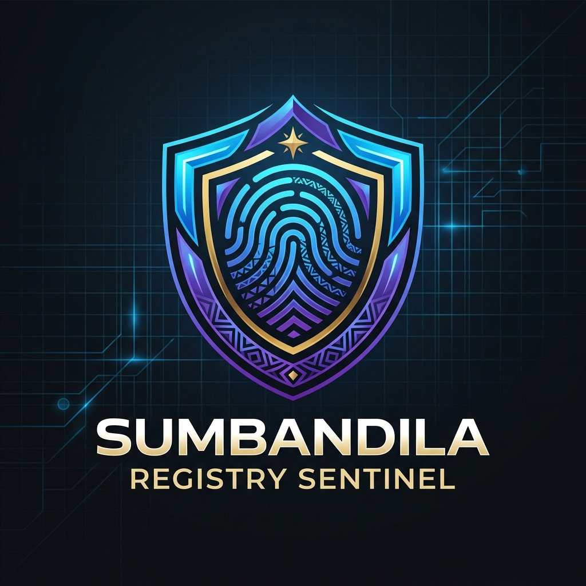
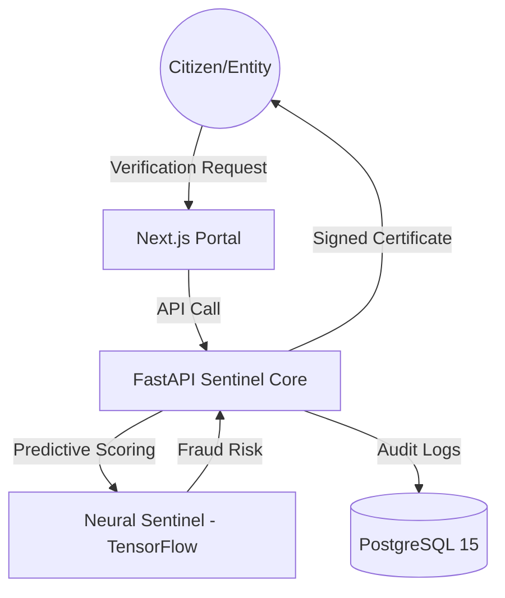

# 🛡️ Sumbandila — Digital Trust Platform v4.0.0



## Sovereign Registry Sentinel

*Building Africa's digital trust layer through AI-driven fraud detection and Blockchain integrity.*

[](https://github.com/Raphasha27/Sumbandila-App/actions)
[](https://github.com/Raphasha27/Sumbandila-App/actions/workflows/codeql.yml)

---

## 🏛️ Architecture Overview

The Sumbandila Platform is a professional, high-integrity digital registry designed for the pan-African landscape. It provides citizens and organizations with the tools to verify the legitimacy of institutions and professionals instantly.


```mermaid
graph TD
    User((Citizen/Entity)) -->|Verification Request| NextJS[Next.js Portal]
    NextJS -->|API Call| FastAPI[FastAPI Sentinel Core]
    FastAPI -->|Predictive Scoring| AI[Neural Sentinel - TensorFlow]
    FastAPI -->|Audit Logs| DB[(PostgreSQL 15)]
    AI -->|Fraud Risk| FastAPI
    FastAPI -->|Signed Certificate| User
```

## 🚀 Key Capabilities

| Capability | Sentinel Feature | Tech Stack |
| :--- | :--- | :--- |
| **Identity Verification** | Instant lookup of HPCSA, DHET, & SAQA data. | FastAPI V4 / Pydantic |
| **Neural Fraud Detection** | Deep Learning risk analysis & ghost detection. | TensorFlow / Keras |
| **Credential Hashing** | Tamper-proof SHA-256 blockchain fingerprints. | Sovereign Logic |
| **Regional Analytics** | Provincial trust distribution & growth insights. | Pandas / Matplotlib |
| **High Integrity** | Block-based audit logs for every verification. | PostgreSQL 15 |

---

## 🏗️ Monorepo Ecosystem

```bash
sumbandila/
├── apps/
│   └── portal/           # Premium Next.js Portal (Consolidated)
├── services/
│   └── core/             # FastAPI V4 Backend (API & Security)
├── packages/
│   └── core-logic/       # Blockchain, Reputation, & Voice Engines
├── ai/
│   ├── fraud_model.py    # ML Fraud Detection (RandomForest)
│   ├── neural_sentinel.py# Deep Learning (TensorFlow)
│   └── analytics_hub.py  # Data Insights (Pandas)
├── tests/                # 100% Green Unit Test Suite
└── scripts/              # Local Sentinel & Security Audits
```

## 🛡️ Security Infrastructure

- **Rate Limiting**: Protected against DoS via `SlowAPI` (5 req/min/IP).
- **Input Sanitization**: Deep Pydantic validation and regex sanitization.
- **Secret Sentinel**: Automated repository auditing via `security-audit.ps1`.

### 🛡️ Sentinel-AI Governance [DEVOPS v4.0]

This repository has transitioned from legacy **ChatGPT Codex** connectors to the **Sentinel-AI (Antigravity)** governance suite.

- **Unified Intelligence**: Automated PR reviews and clinical code audits handled by the Sentinel-AI layer.
- **Node v22 Runtime**: Aligned with Vercel edge runtime for zero-drift deployments.
- **Pillar-Hardened CI**: Branch-agnostic verification gates ensuring 100% green status across the entire Kirov infrastructure.

## 🛠️ Local Sentinel Setup

Ensure your local quality gate is "Green" before any integration.

1. **Bootstrap Environment:**

    ```powershell
    .\scripts\setup-python.ps1
    ```

2. **Run Quality Gate:**

    ```powershell
    .\scripts\local-sentinel.ps1
    ```

## 🌍 Vision & Expansion

*"Sumbandila becomes Africa's digital trust layer."*
**Expansion Plan:** South Africa 🚀 Namibia 🚀 Botswana 🚀 Kenya 🚀 Pan-African

---

## 🛠️ Setup & Usage

### Prerequisites

- Node.js 20 LTS
- Python 3.11+
- PostgreSQL 15

### Setup

```bash
# Install dependencies
npm install

# Setup backend
pip install -r requirements.txt
```

### Run Commands

```bash
# Start Web
npm run dev:web

# Start Backend
npm run dev:backend
```

### Build & Test

```bash
# Build project
npm run build

# Run tests
npm test
```

## 🔐 Environment Variables

Refer to [.env.example](.env.example) for required keys. Run `node scripts/check-env.js` to validate your setup.

## 🚀 Deployment

Deployments are managed via GitHub Actions and triggered on merges to `main`.

- **Vercel**: Web landing page and dashboard.
- **Sovereign Cloud**: Backend services.

## 🛡️ Security Policy

See [SECURITY.md](SECURITY.md) for reporting vulnerabilities. CodeQL and Dependabot are active.

---

*© 2026 Sumbandila Registry Sentinel · Built for National Integrity · Powered by Kirov Dynamics.*
