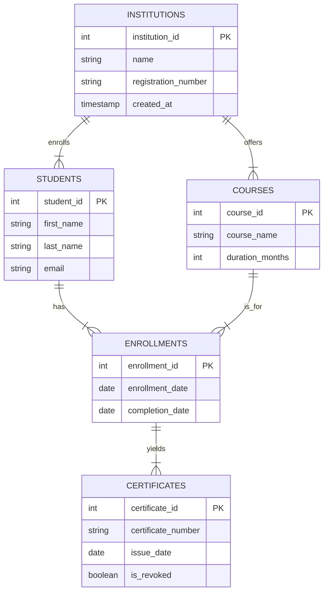

# 🎓 Education Certification & Verification SQL Project

## 📋 Project Overview
This project demonstrates a senior-level relational database design for an **Education Verification System**. It addresses the critical business need for secure, fast, and reliable verification of academic credentials by employers and government bodies.

The system is designed to manage the full lifecycle of a student's academic journey, from enrollment to certification, while enforcing strict business rules to prevent fraud (e.g., preventing certificate issuance for incomplete courses).

## 🛠️ Tech Stack
- **Database Engine:** PostgreSQL 15+
- **Languages:** SQL (PL/pgSQL)
- **Concepts Applied:** 
  - 3rd Normal Form (3NF) Normalization
  - ACID Compliant Transactions
  - Advanced Indexing Strategies (B-Tree)
  - Database Triggers for Business Logic
  - Materialized Logic (Views)
  - RBAC (Role Based Access Control) readiness

## 📊 ER Diagram (Entity Relationship)



## 📂 Project Structure
- `01_schema.sql` - Core database DDL (Tables, Constraints, Indexes).
- `02_triggers.sql` - PL/pgSQL Functions and Triggers for business rules.
- `03_seed_data.sql` - Sample data to populate the system.
- `04_queries.sql` - Complex analytical and verification queries.

## 🚀 Key Features

### 1. Verification View
A strict view `certificate_verification` is provided to expose only public-safe data, abstracting the complex joins required to validate a credential.

### 2. Fraud Prevention (Triggers)
The system uses `BEFORE INSERT` triggers to ensure integrity:
- **Rule:** A certificate generally cannot be generated if the associated enrollment does not have a `completion_date`.

### 3. Performance
- Indexes on `certificate_number` and `email` ensure O(log n) lookup times even with millions of records.

## 💡 How to Run
1. Ensure PostgreSQL is installed.
2. Create a database: `CREATE DATABASE sumbandila_cert_db;`
3. Execute scripts in order:
   ```bash
   psql -d sumbandila_cert_db -f 01_schema.sql
   psql -d sumbandila_cert_db -f 02_triggers.sql
   psql -d sumbandila_cert_db -f 03_seed_data.sql
   psql -d sumbandila_cert_db -f 04_queries.sql
   ```
